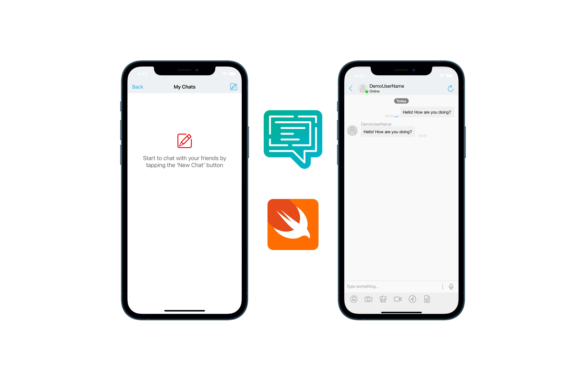

Example on how to integrate Applozic to authenticate a user and create a 1-1 chat feature.
Build using Swift 5, MVC and programmatic coding ( no storyboard).

Features:
- Integration with AppLozic SDK
- Sign up 
- Logged in/ not logged flow to update the UI accordingly 
- 1-1 Chat with AppLozic built-in UI

